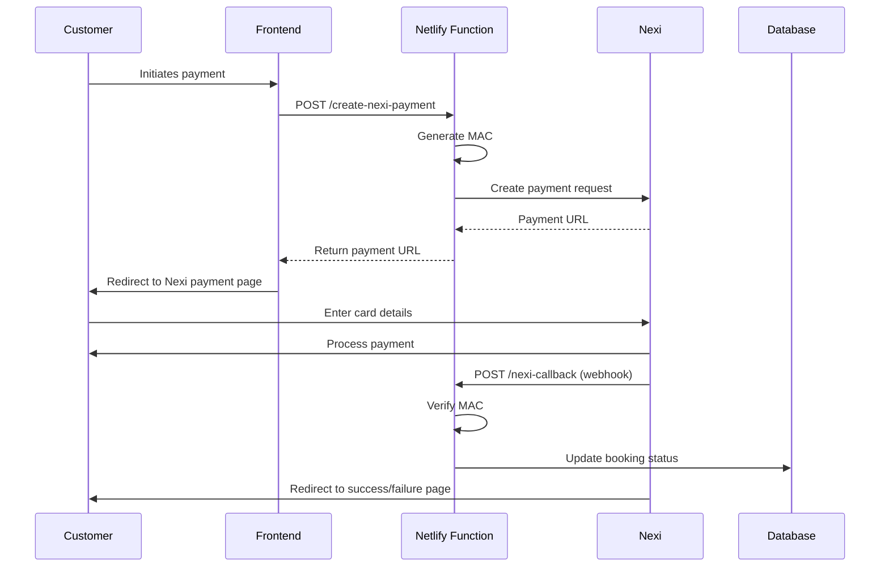

# Nexi X-Pay Setup Guide

## Overview
This guide will help you set up Nexi X-Pay payment integration for DR7 Empire.

## Your Nexi Credentials

Based on the information you provided:

- **Codice Punto Vendita**: `001859607`
- **Terminal ID (TML)**: `03892082`
- **ID Commerciante (Merchant ID)**: `03892082`
- **Alias**: `payment_3892082`
- **Chiave MAC**: ✅ `O1c57OA4aH7o434dH79KCK7IFoh7g0KZ869K1OMt`

### Token Requestor IDs (for Apple Pay / Google Pay)
- **Token Requestor ID VTSM**: ✅ `40060519423`
- **Token Requestor ID MDES**: ✅ `50150403604`

### API Keys
- **Api-Key contabilizzazione implicita** (Terminal 97061508): ✅ `5d952446-9004-4023-9eae-a527a152846b`
- **Api-Key contabilizzazione esplicita** (Terminal 99999986): ✅ `2d708950-50a1-434e-9a93-5d3ae2f1dd9f`

## ✅ All Credentials Available

You now have all the necessary credentials to set up Nexi X-Pay integration!

## Environment Configuration

Update your `.env` file with these values:

```env
# Nexi XPay Payment Gateway
NEXI_ALIAS="payment_3892082"
NEXI_MAC_KEY="O1c57OA4aH7o434dH79KCK7IFoh7g0KZ869K1OMt"
NEXI_MERCHANT_ID="03892082"
NEXI_TERMINAL_ID="03892082"
NEXI_CODICE_PUNTO_VENDITA="001859607"

# Production API Keys
NEXI_API_KEY_PRODUCTION="5d952446-9004-4023-9eae-a527a152846b"
NEXI_API_KEY_MANUAL_PRODUCTION="2d708950-50a1-434e-9a93-5d3ae2f1dd9f"

# Sandbox API Key (use production key for sandbox testing)
NEXI_API_KEY_SANDBOX="5d952446-9004-4023-9eae-a527a152846b"

# Token Requestor IDs for Apple Pay / Google Pay
NEXI_TOKEN_REQUESTOR_ID_VTSM="40060519423"
NEXI_TOKEN_REQUESTOR_ID_MDES="50150403604"

# Environment (sandbox or production)
NEXI_ENVIRONMENT="sandbox"  # Change to "production" when ready to go live
VITE_NEXI_ENVIRONMENT="sandbox"

# API Base URLs (these are correct, no need to change)
NEXI_API_BASE_URL_SANDBOX="https://xpaysandboxdb.nexigroup.com"
NEXI_API_BASE_URL_PRODUCTION="https://xpay.nexigroup.com"
```

## Testing in Sandbox Mode

### 1. Set Environment to Sandbox
Ensure `NEXI_ENVIRONMENT="sandbox"` in your `.env` file.

### 2. Test Credit Cards
Nexi provides test cards for sandbox testing:

| Card Number | Expiry | CVV | Result |
|-------------|--------|-----|--------|
| 4539970000000006 | 12/25 | 123 | Success |
| 4539970000000014 | 12/25 | 123 | Failure |
| 5255000000000001 | 12/25 | 123 | Success |
| 5255000000000019 | 12/25 | 123 | Failure |

### 3. Test the Integration

1. Create a test booking on your website
2. Proceed to payment
3. You should be redirected to Nexi's payment page
4. Use one of the test cards above
5. Complete the payment
6. You should be redirected back to your success page

## Going Live (Production)

### Before Going Live Checklist

- [ ] Obtain and configure the production MAC Key
- [ ] Obtain and configure the production API Key
- [ ] Update `NEXI_ENVIRONMENT="production"` in your `.env` file
- [ ] Update `VITE_NEXI_ENVIRONMENT="production"` in your `.env` file
- [ ] Test the entire payment flow in production with a small amount
- [ ] Verify webhook callbacks are working
- [ ] Ensure SSL certificate is valid on your domain

### Production Configuration

```env
NEXI_ENVIRONMENT="production"
VITE_NEXI_ENVIRONMENT="production"
```

## How the Integration Works

### 1. Payment Creation Flow



### 2. Key Components

#### a. Create Payment Function
- **File**: `netlify/functions/create-nexi-payment.js`
- **Purpose**: Creates a payment request and returns the Nexi payment URL
- **Endpoint**: `/.netlify/functions/create-nexi-payment`

#### b. Callback Handler
- **File**: `netlify/functions/nexi-callback.js`
- **Purpose**: Receives payment notifications from Nexi and updates booking status
- **Endpoint**: `/.netlify/functions/nexi-callback`

#### c. Nexi Client Utility
- **File**: `utils/nexiClient.ts`
- **Purpose**: Provides TypeScript utilities for Nexi API interactions

### 3. MAC (Message Authentication Code)

The MAC is a security mechanism that ensures:
- Requests are authentic and haven't been tampered with
- Callbacks from Nexi are genuine

**How it works:**
1. Parameters are sorted alphabetically
2. Concatenated as `key1=value1key2=value2...`
3. MAC Key is appended
4. SHA1 hash is calculated
5. Hash is sent with the request

## Database Schema

The integration expects these fields in your `bookings` table:

```sql
-- Payment status tracking
payment_status TEXT, -- 'pending', 'paid', 'failed'
nexi_payment_id TEXT, -- Transaction code from Nexi
nexi_authorization_code TEXT, -- Authorization code
nexi_error_message TEXT, -- Error message if payment failed
paid_at TIMESTAMP, -- When payment was completed
```

## Troubleshooting

### Common Issues

#### 1. "Missing Nexi configuration" Error
- **Cause**: MAC Key or API Key not set in environment variables
- **Solution**: Add the missing values to your `.env` file and redeploy

#### 2. "Invalid MAC" Error
- **Cause**: MAC Key mismatch or incorrect parameter ordering
- **Solution**: Verify your MAC Key is correct in the Nexi Backoffice

#### 3. Payment Not Updating in Database
- **Cause**: Webhook callback not being received or processed
- **Solution**: Check Netlify function logs for errors

#### 4. Redirect URLs Not Working
- **Cause**: Incorrect site URL configuration
- **Solution**: Verify `URL` environment variable in Netlify is set to `https://dr7empire.com`

### Debugging

Enable detailed logging by checking:
1. **Netlify Function Logs**: Netlify Dashboard → Functions → Logs
2. **Browser Console**: Check for any JavaScript errors
3. **Network Tab**: Inspect the payment creation request/response

## Security Best Practices

1. **Never commit `.env` file** - It's already in `.gitignore`
2. **Use environment variables** - All sensitive data should be in Netlify environment variables
3. **Verify MAC on callbacks** - Always verify the MAC to prevent fraud
4. **Use HTTPS only** - Ensure your site uses SSL
5. **Validate amounts** - Always validate payment amounts server-side

## Next Steps

1. **Get your MAC Key** from Nexi Backoffice
2. **Get your API Keys** from Nexi Backoffice
3. **Update your `.env` file** with the correct values
4. **Deploy to Netlify** with updated environment variables
5. **Test in sandbox mode** using test cards
6. **Go live** when ready

## Support

- **Nexi Documentation**: https://developer.nexigroup.com/xpayglobal/en-EU/api/
- **Nexi Support**: Contact your Nexi account manager
- **Technical Issues**: Check Netlify function logs

---

## Quick Reference: Where to Find Your Credentials

| Credential | Where to Find It |
|------------|------------------|
| MAC Key | Nexi Backoffice → Configurazione → Chiave MAC |
| API Key | Nexi Backoffice → Configurazione → API Key |
| Merchant ID | Provided in your contract (you have this: 03892082) |
| Terminal ID | Provided in your contract (you have this: 03892082) |
| Alias | Provided in your contract (you have this: payment_3892082) |
